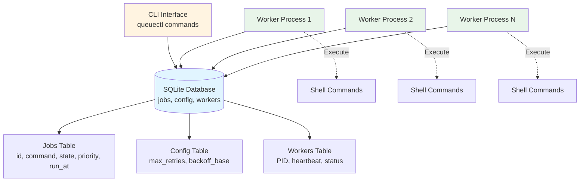
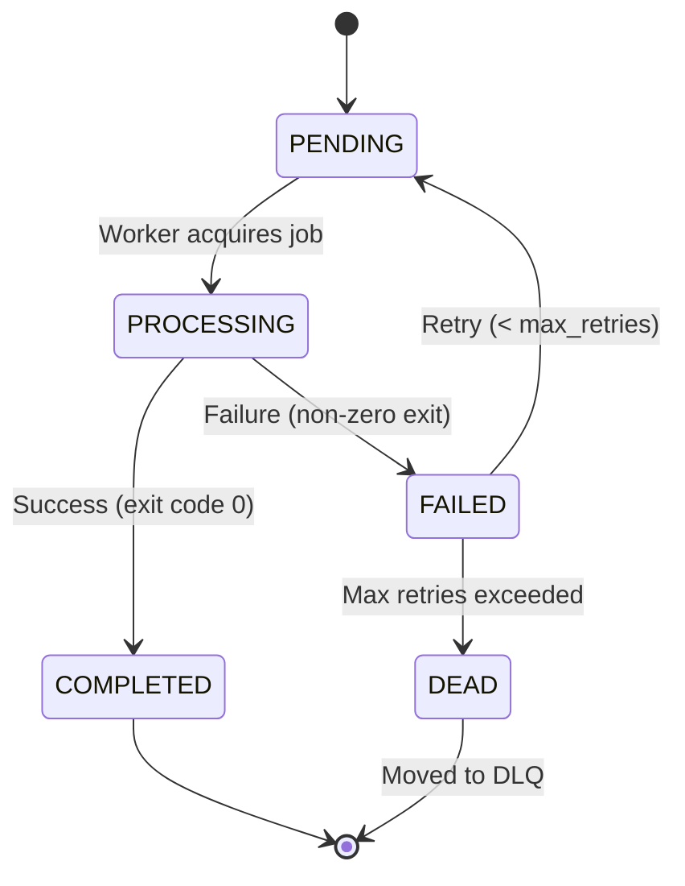

# 🐊 CrocQueuectl - CLI Background Job Queue System

```
╔════════════════════════════════════════════╗
║                                            ║
║   🐊 CrocQueuectl - Job Queue System       ║
║                                            ║
╚════════════════════════════════════════════╝
```

**CrocQueuectl** - A production-grade CLI-based background job queue system with worker processes, configurable retry logic using exponential backoff, and a Dead Letter Queue (DLQ) for failed jobs.

## Features

- **Job Enqueuing**: Add jobs with a simple JSON format
- **Multi-worker Support**: Run multiple workers concurrently  
- **Priority Queues**: Jobs with higher priority (1-10) execute first
- **Scheduled Jobs**: Schedule jobs for specific times or delays
- **Retry Logic**: Automatic retry with configurable exponential backoff
- **Dead Letter Queue (DLQ)**: Failed jobs are moved to DLQ after max retries
- **Persistence**: SQLite-backed, survives restarts
- **Graceful Shutdown**: Workers handle signals properly
- **Concurrency Safe**: No duplicate job processing
- **Runtime Configuration**: Configure max retries and backoff base
- **Metrics Dashboard**: Real-time execution statistics and throughput monitoring
- **Job Output Logging**: Capture and store job execution output
- **Performance Analytics**: Success rates, retry statistics, and failure tracking

## Installation

### Prerequisites
- Python 3.8+ (tested with Python 3.13)
- conda or pip

### Setup with Conda (Recommended)

```bash
# Create conda environment
conda create --name queuectl python=3.13
conda activate queuectl

# Clone the repository
git clone <repository-url>
cd flam_queuectl

# Install dependencies and package
pip install -r requirements.txt
pip install -e .
```

### Setup with pip

```bash
# Clone the repository
git clone <repository-url>
cd flam_queuectl

# Create virtual environment
python -m venv venv
source venv/bin/activate  # On Windows: venv\Scripts\activate

# Install dependencies and package
pip install -r requirements.txt
pip install -e .
```

## Usage

### Basic Commands

#### 1. Enqueue a Job

```bash
# Enqueue a job
queuectl enqueue '{"id":"job1","command":"echo Hello, World!"}'

# Enqueue with priority (1=low, 5=normal, 10=high)
queuectl enqueue '{"id":"urgent","command":"important_task.sh"}' --priority 10
queuectl enqueue '{"id":"background","command":"cleanup.sh"}' --priority 1

# Schedule jobs for later
queuectl enqueue '{"id":"later","command":"backup.sh"}' --delay 30m
queuectl enqueue '{"id":"scheduled","command":"report.py"}' --run-at "2025-11-12 15:00:00"

# Start workers
queuectl worker start --count 3

# Check status
queuectl status

# List jobs (shows priority and scheduled times)
queuectl list --state pending
queuectl list --state completed

# Stop workers
queuectl worker stop
```

#### 2. Start Workers

```bash
# Start a single worker
queuectl worker start

# Start multiple workers
queuectl worker start --count 3
```

#### 3. Check Status

```bash
# Show overall status
queuectl status

# Example output:
# Job Queue Status
# ========================================
# Pending        3 jobs
# Processing     1 jobs
# Completed      10 jobs
# Failed         2 jobs
# Dead           1 jobs
```

#### 4. List Jobs

```bash
# List all jobs
queuectl list

# List jobs by state
queuectl list --state pending
queuectl list --state completed
queuectl list --state failed
```

#### 5. Dead Letter Queue Management

```bash
# List jobs in DLQ
queuectl dlq list

# Retry a job from DLQ
queuectl dlq retry job1
```

#### 6. Configuration

```bash
# View all configuration
queuectl config get

# Get specific config value
queuectl config get max-retries

# Set configuration values
queuectl config set max-retries 5
queuectl config set backoff-base 3
```

#### 7. Metrics and Analytics

```bash
# Show basic metrics
queuectl metrics

# Show detailed metrics with worker stats
queuectl metrics --detailed

# Example output:
# CrocQueuectl Metrics Dashboard
# ==================================================
# Execution Statistics
# Completed: 150 jobs
# Success Rate (24h): 95.5%
# Throughput: 2.5 jobs/minute
```

## Architecture

### System Overview



### Job Lifecycle



### Data Persistence

- **Database**: SQLite with WAL mode for concurrent access
- **Location**: `data/queuectl.db`
- **Tables**: 
  - `jobs`: Job queue and metadata
  - `config`: Runtime configuration
  - `workers`: Active worker tracking

### Worker Coordination

- **Locking**: `BEGIN IMMEDIATE TRANSACTION` prevents race conditions
- **Job Acquisition**: Atomic SELECT + UPDATE pattern
- **Heartbeat**: Workers send periodic heartbeats
- **Stale Detection**: Automatic cleanup of crashed workers

### Exponential Backoff

```python
delay = backoff_base ^ attempts  # in seconds
# Example with base=2:
# Attempt 1: 2s delay
# Attempt 2: 4s delay  
# Attempt 3: 8s delay
```

## Testing

Run the comprehensive test suite:

```bash
# Activate environment
conda activate queuectl

# Run tests
python test_queuectl.py
```

Test scenarios covered:
1. Basic job success
2. Retry with exponential backoff
3. Invalid command handling
4. Data persistence across restarts
5. Configuration management
6. Worker processing
7. DLQ operations

## Project Structure

```
queuectl/
├── queuectl/
│   ├── __init__.py       # Package initialization
│   ├── cli.py            # Click CLI commands
│   ├── database.py       # SQLite operations
│   ├── job.py            # Job execution logic
│   ├── worker.py         # Worker process management
│   └── config.py         # Configuration handling
├── data/
│   └── queuectl.db       # SQLite database (created on first run)
├── requirements.txt      # Python dependencies
├── setup.py             # Package setup
├── test_queuectl.py     # Test suite
└── README.md            # This file
```

## Configuration Options

| Key | Default | Description |
|-----|---------|-------------|
| `max-retries` | 3 | Maximum retry attempts before moving to DLQ |
| `backoff-base` | 2 | Base for exponential backoff calculation |

## Design Decisions

### Why SQLite?
- **ACID compliance** ensures data integrity
- **Built-in locking** with proper transaction modes
- **No external dependencies** - part of Python standard library
- **WAL mode** enables concurrent reads while writing

### Why Python + Multiprocessing?
- **Process isolation**: Worker crashes don't affect others
- **True parallelism**: Bypasses Python's GIL
- **Simple deployment**: No complex runtime requirements
- **Rich ecosystem**: Excellent CLI and testing libraries

### Race Condition Prevention

The critical pattern for atomic job acquisition:

```sql
BEGIN IMMEDIATE TRANSACTION;  -- Get write lock upfront
SELECT * FROM jobs WHERE state='pending' LIMIT 1;
UPDATE jobs SET state='processing' WHERE id=? AND state='pending';
COMMIT;
```

This ensures:
- No two workers can process the same job
- No jobs are lost during concurrent access
- Failed workers release jobs back to the queue

## Known Limitations

1. **Local only**: Not distributed across machines (single SQLite database)
2. **No distributed locking**: Cannot scale across multiple machines
3. **Limited monitoring**: CLI-based status and metrics only (no web dashboard)
4. **Fixed timeout**: Jobs have a 5-minute execution timeout

## Troubleshooting

### Workers not picking up jobs
- Check if workers are running: `queuectl status`
- Verify jobs are in pending state: `queuectl list --state pending`
- Check for stale locks: Restart workers

### Jobs stuck in processing
- Workers may have crashed
- Stop all workers: `queuectl worker stop`
- Database will auto-recover stuck jobs after 30 seconds

### Database locked errors
- Ensure only one instance of queuectl is managing workers
- Check file permissions on `data/queuectl.db`

## Contributing

1. Ensure all tests pass
2. Follow Python PEP 8 style guide
3. Add tests for new features
4. Update documentation

## License

MIT License - See LICENSE file for details

## Acknowledgments

- Built with [Click](https://click.palletsprojects.com/) for CLI
- Inspired by job queue patterns from Sidekiq, Celery, and RQ
- SQLite concurrency patterns from [jasongorman.uk](https://jasongorman.uk/writing/sqlite-background-job-system/)
